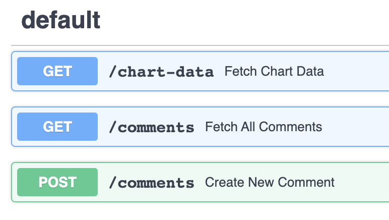

# Chart Application Api (FastApi)
This project was created using [FastApi](https://fastapi.tiangolo.com/).

## Endpoints
This API has 2 endpoints and accept 2 methods [GET, POST]:

## How to run this project

1. ##### Clone this repository
> https://github.com/EinsteinNjoroge/chart-fastApi

 - Navigate to the project's directory in your terminal

2. ##### Install Python

​	You can find the documentation for python **[here](https://www.python.org/)**
​	https://www.python.org/

3. ##### Create a virtual environment

    ​Use this [**guide**](http://sourabhbajaj.com/mac-setup/Python/virtualenv.html).

    ​Activate the  virtual environment.

4. ##### Install project dependencies
   Run the command `pip -r install requirements.txt` on the command line

5. ##### Start the server
   Run the command `python -m uvicorn main:app` on the command line, this will run the server on port `8080`.

   You can check if the server is running by opening [http://127.0.0.1:8000](http://127.0.0.1:8000) on your browser 

   Once you start the server, you can access more detailed API documentation here [http://127.0.0.1:8000/docs#/](http://127.0.0.1:8000/docs#/)

6. ##### Testing
   unit-tests on this repository are written using `TestClient` from `FastApi`.

   Run the test by running `pytest` on the command line
